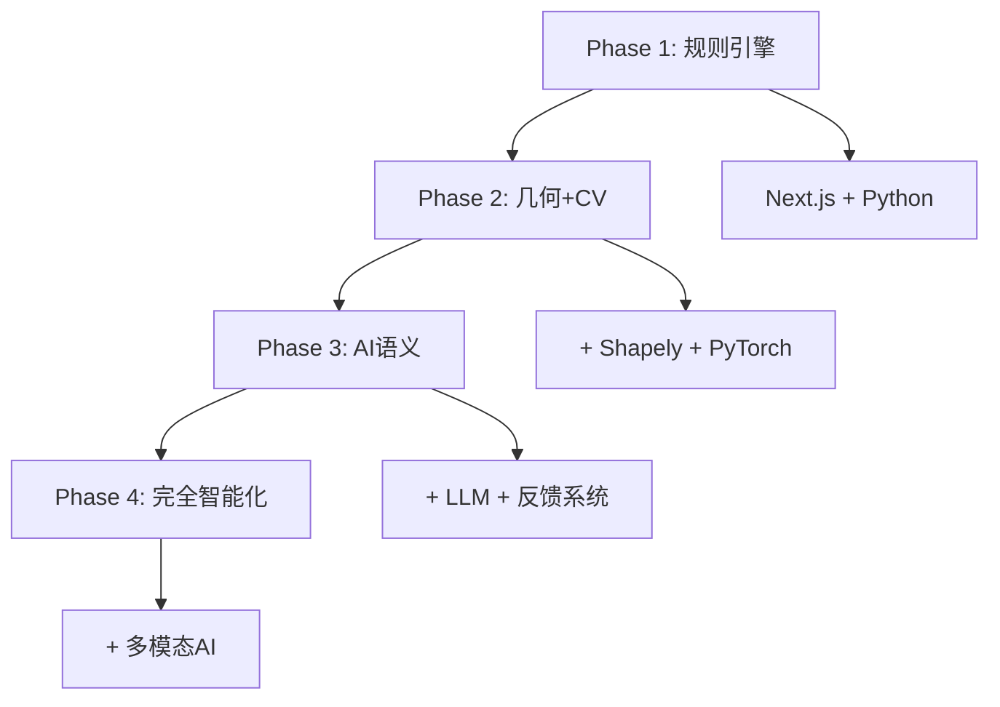

# CAD 合规性检查器 - 技术路线图

> **项目名称**: AI驱动的CAD图纸自动检查系统  
> **技术标准**: GB/T 14665-2012 机械工程CAD制图规则  
> **当前版本**: v1.0 (Phase 1 完成 85%)  
> **最后更新**: 2025-10-22

---

## 📊 项目概览

### 技术架构
- **前端**: Next.js 14 + TypeScript + Tailwind CSS
- **后端**: Python 3.9+ + FastAPI + Vercel Serverless
- **文件解析**: ezdxf (DXF) + ODA Converter (DWG)
- **部署平台**: Vercel (全栈Serverless)
- **数据存储**: 文件系统 + JSON报告

### 核心功能定位
1. **自动化检查**: 替代人工的CAD制图规范检查
2. **标准合规**: 严格按照GB/T 14665-2012标准执行
3. **智能分析**: 从基础属性检查演进至AI语义理解
4. **可视化报告**: 提供直观的错误定位和修复指导

---

## 🎯 Phase 1: MVP基础规则引擎 (85% 完成)

### 技术栈选型
```
前端技术栈:
├── Next.js 14 (App Router)    # React全栈框架
├── TypeScript                 # 静态类型检查
├── Tailwind CSS              # 样式框架
└── Vercel Platform           # 部署平台

后端技术栈:
├── Python 3.9+               # 核心语言
├── ezdxf                     # DXF文件解析
├── pydantic                  # 数据验证
├── PyYAML                    # 配置管理
└── Vercel Functions          # Serverless API
```

### 已实现核心模块

#### 1. 文件处理引擎
```python
# 文件解析架构
frontend/
├── api/check.py              # 统一检查API端点
├── checker/
│   ├── parser.py            # DXF/DWG解析器
│   ├── models.py            # 数据模型定义
│   └── checker.py           # 规范检查引擎
└── config/rules_gbt14665.yaml # 规则配置
```

**关键技术特性**:
- 支持DXF直接解析 (ezdxf)
- DWG多策略转换 (ezdxf → ODA Converter → LibreDWG)
- 10MB文件大小限制
- 实时上传进度反馈
- 统一API端点 `/api/check`

#### 2. 规范检查引擎
```yaml
# 规则引擎架构 (config/rules_gbt14665.yaml)
standards:
  layers:     # 图层规范 (GB/T 14665 表6)
  lineweights: # 线宽规范 (表1)  
  colors:     # 颜色规范 (表2)
  fonts:      # 字体规范 (表3)
  dimensions: # 尺寸标注 (6.3节)
```

**实现的检查项**:
- ✅ 图层命名规范 (尺寸层、文字层)
- ✅ 线宽标准化 (0.7/0.5/0.25mm)
- ✅ 颜色规范验证
- ✅ 文字高度检查 (最小2.5mm)
- ✅ 尺寸标注一致性 (95%阈值)
- ✅ 隐藏/冻结图层检测

#### 3. 报告生成系统
```typescript
// 前端报告架构
app/
├── page.tsx                  # 上传界面
├── report/[id]/page.tsx     # 报告展示
└── components/
    ├── FileUpload.tsx       # 文件上传组件
    ├── AnalysisStatus.tsx   # 分析状态
    └── ComplianceReport.tsx # 合规报告
```

**报告功能**:
- 实时分析状态轮询
- 0-100分合规评分
- 三级严重程度 (严重/警告/提示)
- 详细实体信息展示
- JSON/HTML格式导出

---

## 🚀 Phase 2: 高级空间与视觉分析 (15% 完成)

### 技术演进方向

#### 1. 几何计算引擎升级
```python
# 计划中的几何引擎架构
core/geometry/
├── __init__.py
├── spatial_analysis.py      # 空间关系分析
├── collision_detection.py   # 碰撞检测
├── alignment_checker.py     # 对齐验证
└── distance_calculator.py   # 距离计算

# 技术栈升级
dependencies = {
    "shapely": "2.0+",        # 高级几何计算
    "numpy": "1.24+",         # 数值计算优化
    "scipy": "1.10+",         # 科学计算
}
```

**目标检测能力**:
- 尺寸线与文字相交检测
- 尺寸线端点距离验证
- 多种对齐检测 (垂直/水平/小数点)
- 复杂几何关系验证

#### 2. 计算机视觉子系统
```python
# CV模块架构设计
core/vision/
├── __init__.py
├── renderer.py              # CAD→图像渲染
├── roi_detector.py         # 感兴趣区域检测
├── clarity_classifier.py   # 清晰度分类
└── model_inference.py      # ONNX推理引擎

# 技术栈规划
cv_stack = {
    "pytorch": "2.0+",        # 模型训练
    "opencv-python": "4.8+",  # 图像处理
    "onnxruntime": "1.15+",   # 模型推理
    "cadquery": "2.4+",       # 合成数据生成
}
```

**核心功能规划**:
- ROI自动识别 (锐角/密集区域/重叠文字)
- DXF→PNG/SVG高质量渲染
- 轻量级分类模型 (MobileNetV3/EfficientNet)
- 10,000+合成样本 + 1,000+真实标注

#### 3. 交互式可视化报告
```typescript
// 前端可视化架构
components/visualization/
├── DrawingViewer.tsx        # SVG图纸查看器
├── ErrorOverlay.tsx         # 错误标记层
├── LayerControl.tsx         # 图层控制
└── NavigationPanel.tsx      # 导航面板

// 技术栈
visualization_stack = {
  "d3": "7.8+",              # SVG渲染引擎
  "zustand": "4.4+",         # 状态管理
  "framer-motion": "10.16+", # 动画系统
}
```

**UI设计理念**:
```
┌─────────────────────────────────────────┐
│  错误列表 (30%)  │   图纸预览 (70%)     │
├─────────────────┼─────────────────────┤
│ ⚠️ 尺寸标注错误   │   [交互式SVG]        │
│ 📍 位置: (125,230) │   🔴 错误区域高亮    │
│ 严重程度: 警告    │   🔍 缩放&平移       │
│ [点击定位]       │   🎨 图层开关        │
└─────────────────┴─────────────────────┘
```

---

## 🧠 Phase 3: 语义与上下文智能 (0% 完成)

### AI驱动的智能化升级

#### 1. LLM文本分析引擎
```python
# LLM集成架构
core/ai/
├── __init__.py
├── text_extractor.py       # 技术要求提取
├── llm_client.py          # LLM API客户端
├── prompt_templates.py     # 提示词模板
└── semantic_checker.py     # 语义检查器

# AI技术栈
ai_stack = {
    "google-generativeai": "0.3+",  # Gemini API
    "langchain": "0.0.300+",        # LLM编排
    "tiktoken": "0.5+",             # 令牌计算
}
```

**智能检查能力**:
- MTEXT内容语义分析
- 简化字规范验证 (GB/T 14665 5.4节)
- 术语标准化检查
- 技术表述完整性验证
- 矛盾检测和一致性分析

#### 2. 生成式错误解释系统
```python
# 错误解释生成示例
def generate_smart_explanation(violation):
    prompt = f"""
    作为CAD制图规范专家，请为以下违规生成解释：
    
    违规类型: {violation.type}
    GB/T标准: {violation.standard_clause}
    具体描述: {violation.description}
    
    请生成包含以下内容的解释：
    1. 违规原因 (为什么这违反标准)
    2. 潜在影响 (对制图质量的影响)  
    3. 修复步骤 (具体操作指南)
    4. 最佳实践 (避免类似问题)
    
    要求：中文回复，150-200字，专业但易懂
    """
    
    return llm_client.generate(prompt)
```

#### 3. Human-in-the-Loop反馈系统
```sql
-- 反馈数据库设计
CREATE TABLE ai_feedback (
    id UUID PRIMARY KEY,
    violation_id UUID,
    user_feedback JSONB,      -- {is_correct, reason, suggestion}
    roi_snapshot TEXT,        -- 区域截图路径
    model_version VARCHAR(20),
    created_at TIMESTAMP
);

CREATE TABLE model_performance (
    version VARCHAR(20) PRIMARY KEY,
    accuracy FLOAT,
    precision FLOAT, 
    recall FLOAT,
    training_samples INTEGER,
    deployed_at TIMESTAMP
);
```

**持续改进循环**:
```
收集用户反馈 → 数据清洗标注 → 模型重训练 → A/B测试 → 灰度发布 → 性能监控
    ↑                                                                    ↓
    ←←←←←←←←←←←← 循环优化 ←←←←←←←←←←←←←←←←←←←←←←←←←←←←←←←←
```

---

## 🏗️ 基础设施与工程优化

### 代码架构重构
```
# 目标统一架构
cad-checker/
├── core/                    # 共享核心模块
│   ├── parsing/            # 文件解析
│   ├── checking/           # 规范检查  
│   ├── geometry/           # 几何计算
│   ├── ai/                # AI功能
│   └── config/            # 统一配置
├── frontend/              # Next.js应用
├── backend/               # FastAPI服务 
├── serverless/            # Vercel Functions
└── docs/                  # 技术文档
```

### 性能优化路线
1. **解析性能**: 大文件分块处理，异步解析
2. **检查性能**: 规则并行执行，结果缓存  
3. **渲染性能**: SVG虚拟化，按需加载
4. **AI性能**: 模型量化，推理优化

### 部署策略演进
```yaml
# Phase 1: Serverless优先
current_deployment:
  frontend: Vercel (Static + SSR)
  backend: Vercel Functions (Python)
  storage: Temporary filesystem
  
# Phase 2: 混合架构  
future_deployment:
  frontend: Vercel (Static)
  api_gateway: Vercel Functions (轻量)
  core_services: Docker + K8s (重计算)
  storage: PostgreSQL + Redis + S3
  
# Phase 3: 微服务化
microservices:
  - cad-parser-service
  - rule-checker-service  
  - ai-analysis-service
  - report-generator-service
```

---

## 📈 技术指标与里程碑

### Phase 1 目标指标 ✅
- **文件支持**: DXF ✅ + DWG ✅
- **检查规则**: 5大类20+项 ✅
- **处理性能**: <10s (10MB文件) ✅
- **准确率**: >95% (基础规则) ✅
- **用户体验**: 一键上传+分析 ✅

### Phase 2 目标指标 🎯
- **几何检查**: 复杂空间关系 📋
- **视觉检查**: CV模型精度>90% 📋
- **处理速度**: <30s (包含CV分析) 📋
- **可视化**: 交互式错误定位 📋
- **批量处理**: CLI工具支持 📋

### Phase 3 目标指标 🔮
- **语义准确率**: >85% (LLM分析) 📅
- **解释质量**: 用户满意度>80% 📅
- **学习能力**: 持续改进机制 📅
- **多语言**: 中英文双语支持 📅
- **企业级**: 私有部署方案 📅

---

## 🤝 技术社区与生态

### 开源贡献计划
1. **核心模块开源**: 检查引擎、几何计算
2. **标准扩展**: 支持更多CAD标准 (ISO、ANSI)
3. **插件生态**: AutoCAD、SolidWorks插件
4. **学术合作**: 高校CAD教学集成

### 技术栈演进路线


---

*本技术路线图将随着项目发展持续更新，反映最新的技术决策和架构演进。*
